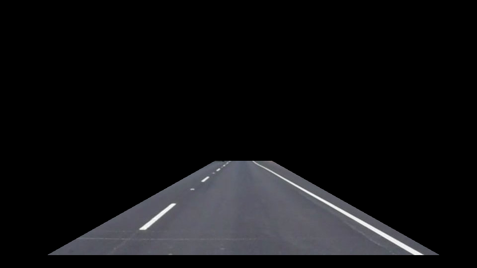
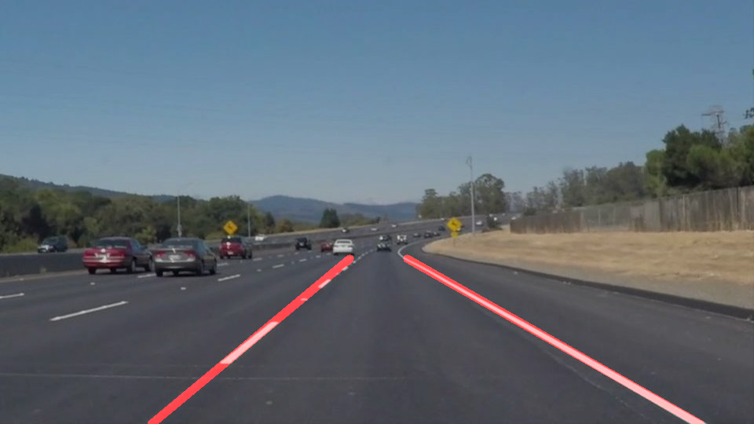

---
output:
  html_document: default
  pdf_document: default
---
# **Finding Lane Lines on the Road** 

**Finding Lane Lines on the Road**

The goals / steps of this project are the following:
* Make a pipeline that finds lane lines on the road
* Reflect on your work in a written report

---

### Reflection

### 1. Describe your pipeline. As part of the description, explain how you modified the draw_lines() function.
The size of the quadrilateral to mask the image is very crucial for lane detections. The quadrilateral vertices were selected after iterating over the test images. The figure below shows a sample image obtained after masking with the selected quadrilateral vertices.

The pipeline consists of 5 steps.

1. Covert to grayscale.
2. Perform Gaussian smoothening using kernel size of 19.
3. Perform edge detection on the smoothened image with `low_threshold = 50` and `high_threshold = 150`.
4. Detect lines using `hough_lines()` function with `rho=2`, `theta = numpy.pi/180`, `threshold=  45`, `min_line_len = 10` and `max_line_gap = 50`.
5. Write the detected lines on the image using `weighted_img()` function.

First, the image was coverted to the gray scale followed by smoothening using Gaussian blurring with a kernel size of 19. The size of the kernel was selected after iterating manually over the test images for suitable edge detection. Gaussian smoothening the image with a kernel size of 19 followed by edge detection with `low_threshold = 50` and `high_threshold = 150` was able to produce the following output.

#### draw_lines() modified as frame_draw_lines
We improved the `draw_lines()` function by replacing it with `frame_draw_lines()`. In the `fame_draw_lines()` function, the left and right lines are identified by computing the `slope` of each line. If `slope<0`, then it is a left line else it is a right line. The weighted average of the `slope` and `intercept` are computed using the `length` of the lines as the weights. To extrapolate the left and right lines, the y-coordinates are fixed to 100% and 61% of the image height. The x-coordinates are obtained using the y-coordinates and the computed `slope` and `intercept` in the line equation.

For images from videos, we peform this average using `deque` with maximum length of 300. Caution has to exercised to clear the `Line` object whenever we start with a new image. Below is the sample output with the line lanes drawn.

### 2. Identify potential shortcomings with your current pipeline

* One potential shortcoming would be that the current pipeline is not generic enough to handle all possible road images. It is heavily dependent on the masking quadrilateral size and the parameters used for line detection.

* Another shortcoming would be the handling of shapr curves in the road.

### 3. Suggest possible improvements to your pipeline

* The pipeline's sensitivity to lighting conditions is also not tested. The parameters have to be robust enough to handle the diverse conditions. Alternatively, a dynamic selection of paramters could be employed.

* Another potential improvement could be to use polynomial functions instead of line function in detecting the lanes.
